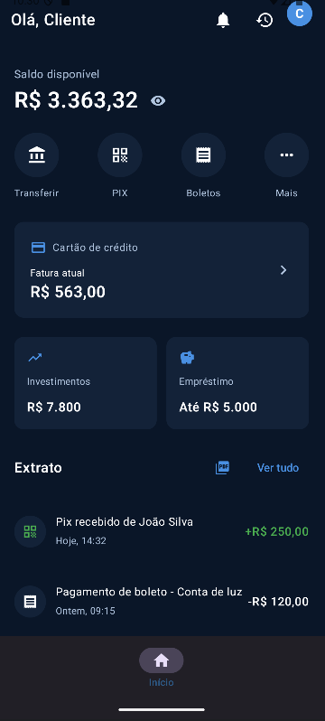

# Agiota Bank

## Sobre o Projeto

O Agiota Bank é um aplicativo desenvolvido em Kotlin que tem como proposta simular um agente bancário digital. Ele foi criado para facilitar o gerenciamento financeiro dos usuários, permitindo realizar operações como transferências, pagamentos e controle de saldo de forma prática e acessível.

O aplicativo busca resolver o problema da dificuldade de acesso a serviços bancários completos em um só lugar, oferecendo uma solução moderna e intuitiva que aproxima as pessoas de uma experiência bancária simples, segura e eficiente.

Captura das telas:
##

